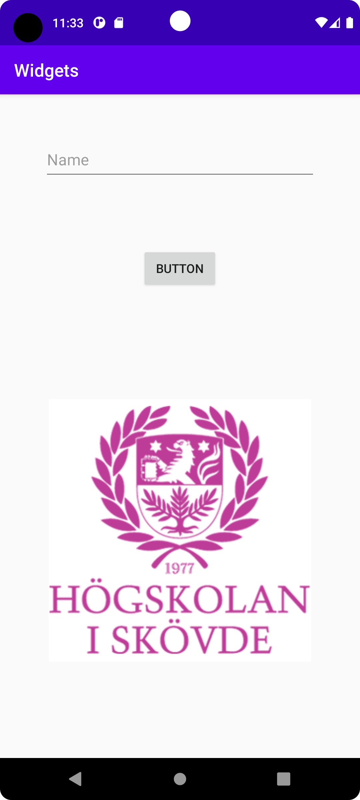

# Rapport

**
Det 1 som gjordes var att forka appen widgets till repository i Android Studio.
Det 1 problemet löstes genom att välja linearLayout och implementera det med lite kod (kolla på snuttkoden).
Det 2 problemet löstes genom att implementera editText view i layouten, därefter göra buttonView och sist 
implementera imageView i linearLayout. För varje av de 3 views användes margin med olika värden.
När button view skulle implementeras användes en clickListener, så när användaren klicker på button
knappen skriver programmet ut en liten text som visas i LogCat.
Det 3 problemet var att positionera de 3 views genom att flytta runt de mha olika attribut som hade 
specifika funktioner och på så sätt snygga till den allmänna utseendet av appen.
**

```
@Override
    protected void onCreate(Bundle savedInstanceState) {
        super.onCreate(savedInstanceState);
        setContentView(R.layout.activity_main);

        Button b = findViewById(R.id.myNewBtn);

        b.setOnClickListener(new View.OnClickListener() {
            @Override
            public void onClick(View view) {
                Log.d("==>","We clicked on Button!");
            }
        });
    }
    
<?xml version="1.0" encoding="utf-8"?>
<LinearLayout xmlns:app="http://schemas.android.com/apk/res-auto"
    xmlns:tools="http://schemas.android.com/tools"
    xmlns:android="http://schemas.android.com/apk/res/android"
    android:layout_width="match_parent"
    android:layout_height="match_parent"
    android:orientation="vertical"
    tools:context=".MainActivity">

    <EditText
        android:id="@+id/myNewEdt"
        android:hint="Name"
        android:layout_width="match_parent"
        android:layout_height="50dp"
        android:layout_margin="50dp" />

    <Button
        android:id="@+id/myNewBtn"
        android:text="Button"
        android:layout_width="wrap_content"
        android:layout_height="wrap_content"
        android:layout_gravity="center"
        android:layout_margin="25dp" />

    <ImageView
        android:id="@+id/imageView"
        android:layout_width="300dp"
        android:layout_height="300dp"
        android:layout_gravity="center"
        android:layout_margin="100dp"
        android:contentDescription="his logo"
        app:layout_constraintBottom_toBottomOf="parent"
        app:layout_constraintEnd_toEndOf="parent"
        app:layout_constraintStart_toStartOf="parent"
        app:layout_constraintTop_toTopOf="parent"
        app:srcCompat="@drawable/his" />
</LinearLayout>
```

Bilder läggs i samma mapp som markdown-filen.



Läs gärna:

- Boulos, M.N.K., Warren, J., Gong, J. & Yue, P. (2010) Web GIS in practice VIII: HTML5 and the canvas element for interactive online mapping. International journal of health geographics 9, 14. Shin, Y. &
- Wunsche, B.C. (2013) A smartphone-based golf simulation exercise game for supporting arthritis patients. 2013 28th International Conference of Image and Vision Computing New Zealand (IVCNZ), IEEE, pp. 459–464.
- Wohlin, C., Runeson, P., Höst, M., Ohlsson, M.C., Regnell, B., Wesslén, A. (2012) Experimentation in Software Engineering, Berlin, Heidelberg: Springer Berlin Heidelberg.
